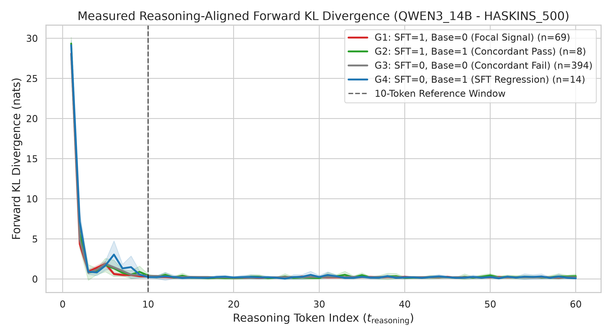
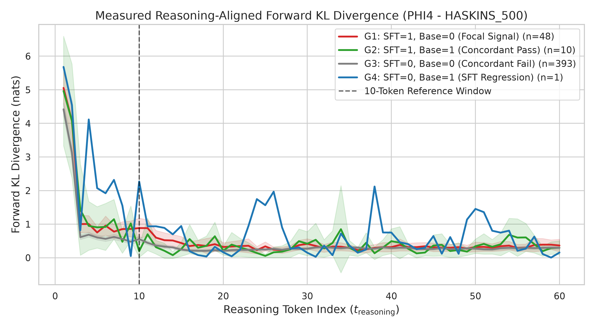
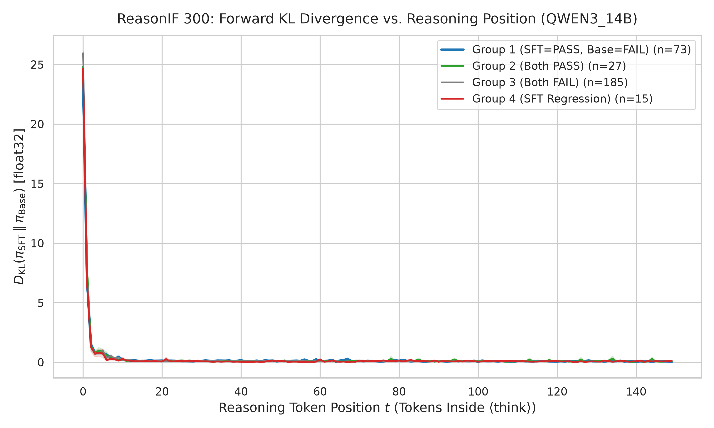
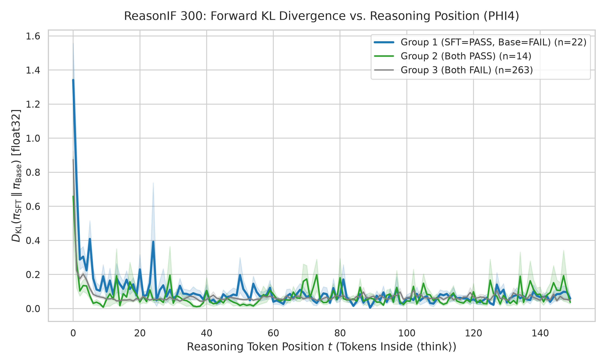
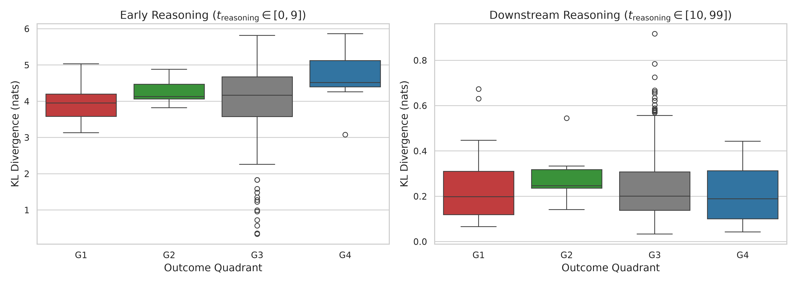
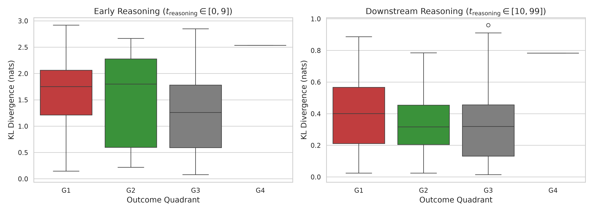
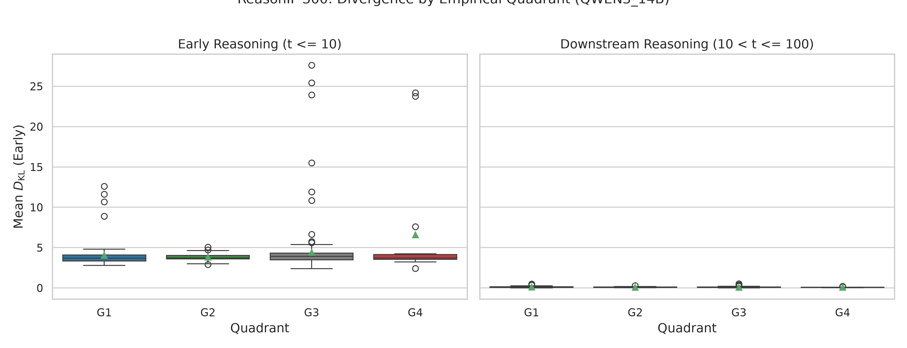
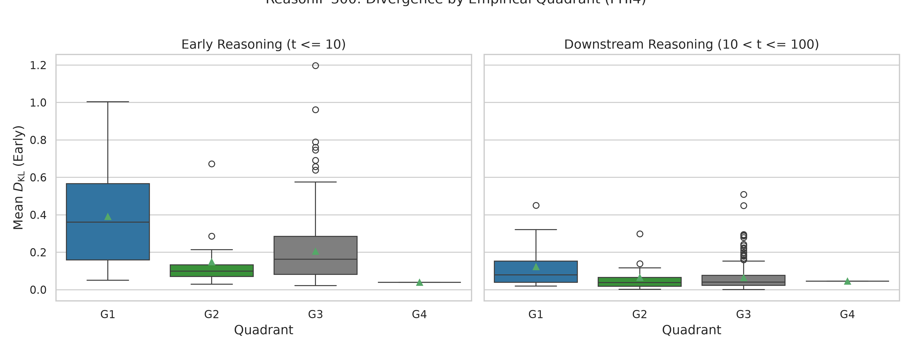

# Empirical Chain-of-Thought KL Divergence Report
## Policy Separation Dynamics: Microsoft Phi-4 vs. Qwen3-14B

This report presents the empirical findings from evaluating **teacher-forced forward Kullback–Leibler (KL) divergence** between an instruction-aligned SFT policy $\pi_{\text{SFT}}$ and an untouched base policy $\pi_{\text{Base}}$ along Chain-of-Thought (CoT) reasoning trajectories:

$$D_{\text{KL}}\big(\pi_{\text{SFT}}(\cdot \mid \bm{x}, \bm{y}_{<t}) \;\parallel\; \pi_{\text{Base}}(\cdot \mid \bm{x}, \bm{y}_{<t})\big) = \sum_{w \in \mathcal{V}} \pi_{\text{SFT}}(w \mid \bm{x}, \bm{y}_{<t}) \log \left( \frac{\pi_{\text{SFT}}(w \mid \bm{x}, \bm{y}_{<t})}{\pi_{\text{Base}}(w \mid \bm{x}, \bm{y}_{<t})} \right)$$

Evaluations were performed across **1,600 total trajectories** (500 Haskins + 300 ReasonIF for each of Qwen3-14B and Phi-4) on an NVIDIA RTX PRO 6000 Blackwell Server Edition GPU (95 GB VRAM) strictly in **`float32`** numerical precision.

---

## 1. Visual Comparison Gallery

### Figure 1: Reasoning Trajectory Curves ($D_{\text{KL}}$ vs. Token Position $t$)
The curves show the mean per-token forward KL divergence (with $\pm 1$ standard error bands) as a function of the token position $t$ strictly inside the reasoning block (starting after `<think>` and terminating before `</think>`).

````carousel

<!-- slide -->

<!-- slide -->

<!-- slide -->

````

---

### Figure 2: Empirical Quadrant Boxplots (Early vs. Downstream Reasoning)
Comparing early reasoning tokens ($t \le 10$) against downstream reasoning tokens ($10 < t \le 100$) stratified across empirical outcome quadrants:
* **G1 (Focal Signal)**: SFT=PASS, Base=FAIL
* **G2 (Concordant Pass)**: SFT=PASS, Base=PASS
* **G3 (Concordant Fail)**: SFT=FAIL, Base=FAIL
* **G4 (SFT Regression)**: SFT=FAIL, Base=PASS

````carousel

<!-- slide -->

<!-- slide -->

<!-- slide -->

````

---

## 2. Quantitative Summary Across Datasets

| Dataset | Architecture | Quadrant | Sample Count | Early KL ($t \le 10$) | Downstream KL ($10 < t \le 100$) | Median Reasoning Length |
| :--- | :--- | :---: | :---: | :---: | :---: | :---: |
| **Haskins 500** | **Qwen3-14B** | **Group 1 (Focal Signal)** | **71** | **3.96 nats** | **0.22 nats** | **287 tokens** |
| | | Group 2 (Both PASS) | 9 | 4.61 nats | 0.29 nats | 305 tokens |
| | | Group 3 (Both FAIL) | 406 | 4.14 nats | 0.24 nats | 260 tokens |
| | | Group 4 (SFT Regression) | 14 | 4.64 nats | 0.21 nats | 566 tokens |
| **Haskins 500** | **Microsoft Phi-4** | **Group 1 (Focal Signal)** | **50** | **1.61 nats** | **0.39 nats** | **154 tokens** |
| | | Group 2 (Both PASS) | 12 | 1.50 nats | 0.34 nats | 107 tokens |
| | | Group 3 (Both FAIL) | 437 | 1.23 nats | 0.32 nats | 133 tokens |
| | | Group 4 (SFT Regression) | 1 | 2.53 nats | 0.78 nats | 166 tokens |
| **ReasonIF 300** | **Qwen3-14B** | **Group 1 (Focal Signal)** | **73** | **4.06 nats** | **0.13 nats** | **283 tokens** |
| | | Group 2 (Both PASS) | 27 | 3.82 nats | 0.10 nats | 349 tokens |
| | | Group 3 (Both FAIL) | 185 | 4.42 nats | 0.10 nats | 688 tokens |
| | | Group 4 (SFT Regression) | 15 | 6.59 nats | 0.09 nats | 642 tokens |
| **ReasonIF 300** | **Microsoft Phi-4** | **Group 1 (Focal Signal)** | **22** | **0.39 nats** | **0.12 nats** | **259 tokens** |
| | | Group 2 (Both PASS) | 14 | 0.15 nats | 0.07 nats | 559 tokens |
| | | Group 3 (Both FAIL) | 263 | 0.21 nats | 0.06 nats | 697 tokens |
| | | Group 4 (SFT Regression) | 1 | 0.04 nats | 0.05 nats | 4,827 tokens |

---

## 3. Verified Findings (recomputed from `caches_float32/` by `scripts/reproduce_tables.py`)

> **Status of this section.** An earlier version of this report claimed that "over 85% to 92% of cumulative divergence is concentrated
> in the first 10 tokens" and described the adapters as "structural gatekeepers" / "continuous token-by-token policing".
> Neither statement is supported by the caches and both were removed. All numbers below are exact outputs of
> `results/summary_tables/table4_kl_percentiles.csv`.

### Finding 1: The first-10-token share depends heavily on the window and on the cohort

| Model / benchmark | Traces (L ≥ 100) | First-10 share of KL, positions 1–100 | First-10 share, full measured length (≤ 512) | Mean KL at t = 1 |
| :--- | :---: | :---: | :---: | :---: |
| Qwen3-14B Haskins | 455 | 66.66 % | 41.93 % | 28.02 nats |
| Qwen3-14B ReasonIF | 269 | 81.37 % | 56.49 % | 25.30 nats |
| Phi-4 Haskins | 334 | 33.70 % | 18.67 % | 4.51 nats |
| Phi-4 ReasonIF | 271 | 28.09 % | 9.54 % | 0.90 nats |

* The "first 100 positions, L ≥ 100" definition is the one used for the headline early-share numbers. It excludes the 45 (Qwen Haskins),
  166 (Phi Haskins), 31 (Qwen ReasonIF) and 29 (Phi ReasonIF) shorter traces and ignores everything after position 100.
* Qwen's early share is dominated by a single position: mean KL at t = 1 is 25–28 nats against roughly 0.1–0.2 nats per later position.
* `scripts/compute_forward_kl.py` reports the all-traces/all-tokens variant (43.6 / 58.1 / 22.4 / 10.9 %), which is a third number; state the definition whenever a share is quoted.

### Finding 2: Downstream divergence does not separate the two models cleanly

Downstream statistics (t > 10, all measured tokens up to 512):

| Model / benchmark | Tokens | Mean | P50 | P99 | P99.9 | Max | Per-sequence max, P95 |
| :--- | :---: | :---: | :---: | :---: | :---: | :---: | :---: |
| Qwen3-14B Haskins | 141,147 | 0.186 | 0.055 | 1.684 | 6.042 | 15.01 | **9.72** |
| Phi-4 Haskins | 76,061 | 0.290 | 0.099 | 2.195 | 6.518 | 11.89 | 8.75 |
| Qwen3-14B ReasonIF | 106,765 | 0.077 | 0.025 | 0.568 | 2.196 | **17.75** | **5.49** |
| Phi-4 ReasonIF | 105,435 | 0.050 | 0.014 | 0.466 | 1.872 | 11.57 | 3.98 |

* Phi-4 has the larger downstream mean on Haskins but the smaller one on ReasonIF; Qwen's per-sequence maximum spikes are *larger* than Phi's on both benchmarks.
  A "Phi has discrete downstream spikes, Qwen does not" contrast is therefore not supported by these statistics.
* Within positions 11–100 of the L ≥ 100 cohort the downstream means are 0.224 / 0.098 (Qwen Haskins / ReasonIF) and 0.261 / 0.056 (Phi Haskins / ReasonIF).

### Finding 3: Outcome-stratified groups are small and dominated by "both fail"

(Early = t ≤ 10, downstream = 10 < t ≤ 100; sample counts as in the table of Section 2.)

* Phi-4 Haskins: G1 n = 50, G2 n = 12, G3 n = 437, G4 n = 1; downstream KL 0.39 (G1), 0.34 (G2), 0.32 (G3).
* Phi-4 ReasonIF: G1 n = 22, G2 n = 14, G3 n = 263, G4 n = 1; downstream KL 0.12 (G1), 0.07 (G2), 0.06 (G3).
* G1 vs G2 compares 22 against 14 traces; G1 vs G3 (the dominant group) is a ratio of roughly 1.2× (Haskins) and 2× (ReasonIF).
  Pass/fail labels are single-sample outcomes at T = 0.6, so these groups mix real differences with sampling noise. No confidence intervals have been computed.

### Finding 4: Teacher-forced agreement is not rollout transfer

> A low forward KL under teacher forcing, D_KL(π_SFT(·|x, y_<t) ‖ π_Base(·|x, y_<t)) ≈ 0, shows that Base agrees with SFT **on SFT-generated
> histories**. It does not show that a Base rollout that merely starts from an SFT prefix stays on a compliant trajectory, and it does not
> identify an optimal prefix length. Interpretations such as "gatekeeper" or "policing" would require interventions (e.g. switching weights
> at position N), which are not part of this repository.

---

## 4. Token-level examples

`results/summary_tables/table5_top_spike_per_task_phi4.csv` lists the highest-KL spike for each Haskins task straight from
`spike_analysis/spike_token_pairs.json` (Phi-4 only; the file carries Phi's A1/A4 scores). The `Base_Run_Strict` / `SFT_Run_Strict` columns are
**whole-trace** outcomes of separate runs, not statements that the displayed base token violates a constraint. The file has no ReasonIF entries.

## 5. Artifact & Data References (all in this repository)

- Verified caches: `caches_float32/kl_cache_{qwen3_14b,phi4}_{haskins_500,reasonif_300}.json`
- Per-sample and per-task CSVs: `tabular_results_csv/`
- Notebook: `analysis_notebook/cot_kl_divergence_analysis.ipynb`
- Recompute everything: `python scripts/reproduce_tables.py`
